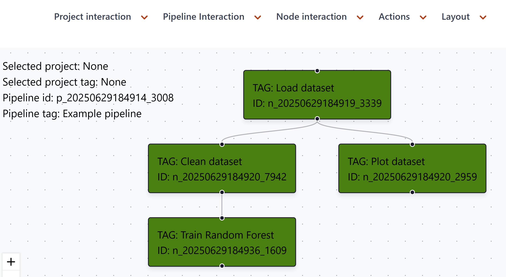

`fusionpipe` is a lightweight pipeline orchestrator designed to streamline data analysis, simulations, and machine learning workflows, fostering better collaboration among users. It enables rapid prototyping with minimal interface complexity while scaling seamlessly to full production systems.

At the heart of `fusionpipe` is the belief that rapid iteration drives effective data science. By keeping the backend interface intentionally simple, `fusionpipe` lets you focus on developing your code with minimal overhead—empowering you to experiment, adapt, and innovate just as you would in your everyday workflow.

`fusionpipe` consists of few core components:

- **Node**
- **Pipeline**

# Node
A node is a directory with a unique `<node_id>` that adheres to the following minimal structure:

```
<node_id>/
├── code/
│   └── main.py
├── data/
│   └── <data files>
├── logs.txt
```

- The `code` folder contains the node's source code, with `main.py` serving as the entry point.
- The `data` folder stores output results generated by the node.
- The `logs.txt` file records execution logs.

The `main.py` script is executed by the pipeline when the node runs. 

Being able to access data from your parent node is the only interface that you need integrate convert your code into a pipeline, and convenience user APIs are provided for that.

A node may include calls to Python scripts, Jupyter notebooks, MATLAB scripts, or other executable code.

# Pipeline
A pipeline is a directed acyclic graph (DAG) that connects multiple nodes. Each node can have multiple parent and child nodes, enabling the creation of complex workflows. The pipeline orchestrator handles node execution based on dependencies, ensuring that parent nodes are processed before their children.



# Getting start
Follow the documentation [https://francescocarpanese.github.io/fusionpipe/](https://francescocarpanese.github.io/fusionpipe/)